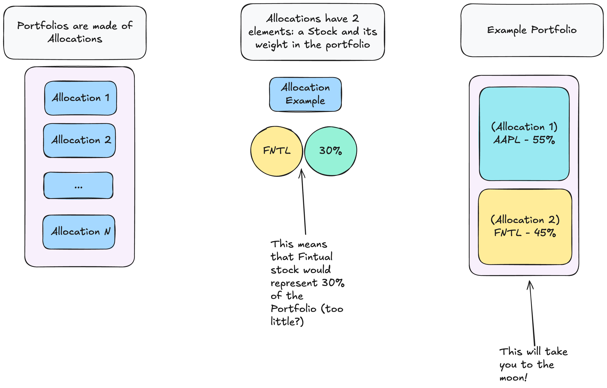
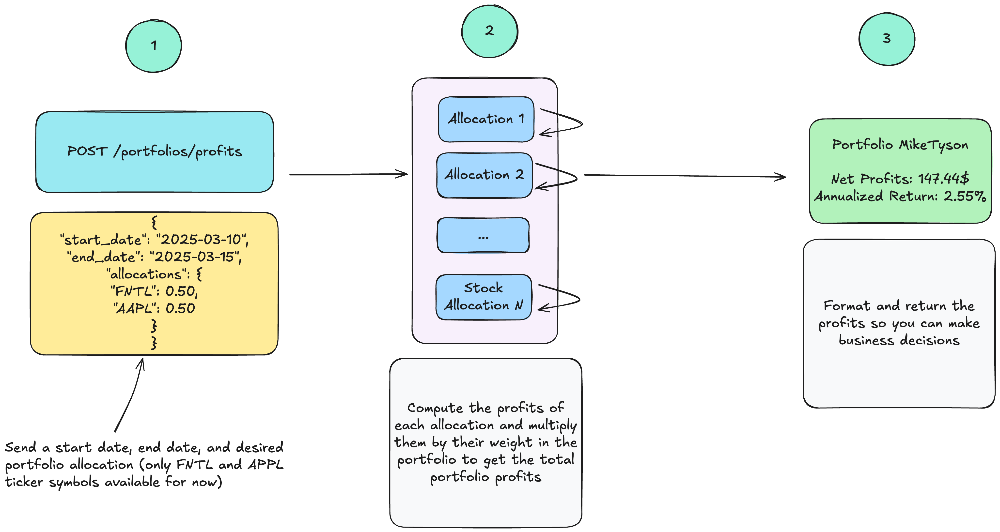
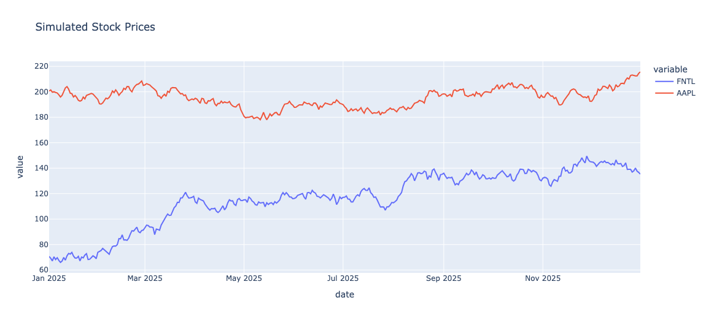

# Introduction

This is part of my application to
the [Sr. Backend Engineer role](https://jobs.lever.co/fintual/26c5379b-4dbc-4ed9-a58e-a1bed26869b0)
at [Fintual](https://fintual.mx/).

These are the original instructions:


> Construct a simple Portfolio class that has a collection of Stocks and a "Profit" method that receives 2 dates
> and returns the profit of the Portfolio between those dates. Assume each Stock has a "Price" method that receives a
> date and returns its price.
>
> Bonus Track: make the Profit method return the "annualized return" of the portfolio between the given dates.

## How it Works

I decided to represent this problem with three main entities: `Portfolios`, `Allocations`, and `Stocks`.
The following image illustrates my thought process:



It seemed to me that this captures the essence of the problem while keeping things simple.

I think that APIs are fun, and this role needs API development experience, so I built a simple API with a single
endpoint that
allows you to compute the profits of a portfolio comprised of a combination of two stocks, `AAPL` (Apple)
and `FNTL` (Fintual). The following image illustrates how this works:



## How to test it

This repo assumes you have Docker installed.

Download the repository and build the Docker image:

```
docker build -t fintual-app .  
```

Then run it with

```
docker run -p 8080:8080 fintual-app
```

And experiment with it

```
curl --location 'http://0.0.0.0:8080/portfolios/12345/profits' \
--header 'Content-Type: application/json' \
--data '{
    "start_date": "2025-01-01",
    "end_date": "2025-12-31",
    "allocations": {
        "FNTL": 50,
        "AAPL": 50
    }
}'

```

In the example above, I'm computing the profits of a portfolio made up of 50% Fintual stock and 50%
Apple stock during 2025.

### JSON Body Guidelines

The body of your request must fulfill the following criteria:

* `start_date` and `end_date` must be in `YYYY-MM-DD` format
* `start_date` and `end_date` must be between `2025-01-01` and `2025-12-31`
* `allocations` is an object that must fulfill the following criteria:
    * It must have at least one element
    * The keys must be either `AAPL` or `FNTL`
    * The weights must be integers (so that you can do QA more easily)
    * The weights must add to `100`

### Stock Prices

Prices are read from a csv called `stock_prices.csv`. They're simulated, but they look kind of real. The csv can be
found [here](https://github.com/EnriqueOrtiz27/fintual-application/blob/main/infrastructure/stock_prices.csv).

This is a graph that represents the csv prices:


_As you can see, Apple is still more valuable than Fintual, but Fintual is doing great!_

# Challenges

This is a test of well I did my job. If it's not clear at all how to solve these questions in less than 10 minutes, I
need
to improve.

* Who did better in 2025, Apple or Fintual? (assuming you go from `2025-01-01` to `2025-12-31`)
* What happens if you send a `start_date` that's greater than the `end_date`?
* What are the net profits of a portfolio made up of 55% FNTL and 45% AAPL from `2025-03-04` to `2025-10-12`

# Appendix

### Doing QA

I recorded a video of me doing some QA, you can watch
it [here](https://www.loom.com/share/4d8b430e053448f2977967d03f740614?sid=94e16037-8f0d-4cf2-a7cb-29206759cdbd).

### First week's prices

I share this table in case it helps you do QA more easily. The entire list
is [here](https://github.com/EnriqueOrtiz27/fintual-application/blob/main/infrastructure/stock_prices.csv).

| date       | FNTL  | AAPL   |
|------------|-------|--------|
| 2025-01-01 | 70.68 | 200.59 |
| 2025-01-02 | 69.19 | 201.46 |
| 2025-01-03 | 67.14 | 199.71 |
| 2025-01-04 | 70.40 | 200.01 |
| 2025-01-05 | 68.22 | 199.50 |
| 2025-01-06 | 69.70 | 199.10 |
| 2025-01-07 | 67.54 | 197.65 |

## Further Improvements

* Define behavior for negative weights (they're allowed now)